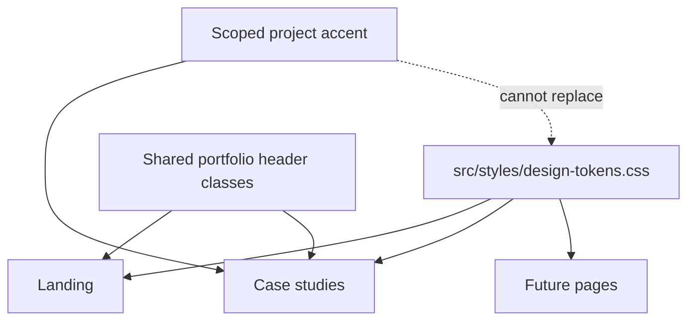

# Portfolio design system

## Summary

This system keeps every portfolio page recognizably part of the same personal product: a sober, technical, warm-dark editorial interface. Individual projects can introduce one accent color and their own imagery, but they must inherit the portfolio shell, typography, layout, surfaces, navigation, interaction states, and evidence language.

The canonical code tokens live in `src/styles/design-tokens.css`. This document defines how those tokens should be used in future pages and components.

## User experience

Visitors should experience one coherent portfolio rather than a collection of unrelated microsites:

- The typographic Tomás Garbarino signature anchors every page. Do not add a monogram, icon, avatar mark, or favicon as a personal logo.
- A dark ink canvas and ivory text establish the parent identity.
- Coral communicates primary emphasis and action; mineral violet adds technical depth; mint communicates verified or healthy states.
- Project branding appears inside evidence frames, imagery, and one scoped accent—not by replacing the parent navigation or global canvas.
- Claims must distinguish implemented work, active validation, prototypes, and future intent.

## Foundations

### Color roles

| Token | Value | Role |
| --- | --- | --- |
| `--bg` | `#09090c` | Global page canvas |
| `--surface` | `#111016` | Primary panels and cards |
| `--surface-2` | `#181620` | Nested or alternate surfaces |
| `--text` | `#f5f0e8` | Primary text and high-contrast controls |
| `--muted` | `#aaa4ad` | Supporting copy |
| `--muted-2` | `#85808c` | Metadata and tertiary labels |
| `--accent` | `#fa8b67` | Primary action, emphasis, and focus |
| `--accent-2` | `#8f86e8` | Secondary technical emphasis |
| `--success` | `#83d8b8` | Verified, current, live, or healthy states |

Use semantic tokens instead of raw hex values. Raw colors are permitted only for a scoped project accent such as Trainly orange (`--project-accent`) and must not replace the parent system roles.

### Typography

- Interface and editorial text: `--font-sans` (`Inter`).
- Metadata, statuses, indices, technical labels, and evidence captions: `--font-mono` (`JetBrains Mono`).
- Display headings use tight tracking (`--tracking-display`) and compact leading (`--leading-display`).
- Multi-line body copy uses `--leading-copy`.
- Use sentence case for headings. Reserve uppercase for short mono labels.
- Keep the number of typefaces at two; never introduce a project-specific font into the interface shell.

Recommended scale:

| Style | Desktop | Mobile | Usage |
| --- | --- | --- | --- |
| Hero | `clamp(54px, 6vw, 82px)` | `45–61px` | Page premise |
| Section title | `clamp(39px, 4.8vw, 66px)` | same clamp | Major narrative chapter |
| Lead copy | `16–19px` | `15–17px` | Introductory explanation |
| Body | `12–16px` | `12–15px` | Supporting content |
| Mono label | `8–10px` | `8–9px` | Status, index, metadata |

### Layout

- Content container: `--container: 1180px`.
- Desktop gutter: `--gutter: 20px`; mobile page width is `calc(100% - 28px)`.
- Background grid unit: `--grid-unit: 64px`.
- Major section rhythm: approximately `--section-space: 118px`.
- Use grid for explicit alignment. The desktop header must remain `1fr auto 1fr` so navigation is geometrically centered.
- Long-form case studies may add a sticky table of contents, but their story column must align to the parent container.

### Shape and elevation

- Small control: `--radius-sm: 10px`.
- Card: `--radius-md: 14px`.
- Floating navigation or prominent panel: `--radius-lg: 18px`.
- Hero evidence, featured card, or closing panel: `--radius-xl: 24px`.
- Pills are reserved for navigation states, statuses, and compact actions.
- Use `--shadow-panel` only for raised evidence panels; ordinary cards should rely primarily on borders and surface contrast.

## Components

### Portfolio header

Required on the landing and every standalone case study:

```text
╭──────────────────────────────────────────────────────────╮
│ Tomás Garbarino   [01 Section  02 Section  03 Section]  [Let's talk ↗] │
│ Product Engineer / AI Builder                            │
╰──────────────────────────────────────────────────────────╯
```

- Left: typographic personal signature and role.
- Center: a maximum of three context-relevant destinations.
- Right: the shared contact CTA.
- Mobile: hide center navigation and keep the name plus CTA.
- Do not place a project logo in the parent header.

### Buttons

- Primary: coral-to-warm gradient, dark text, one verb-led action.
- Secondary: transparent dark surface with system border and ivory text.
- Text links: inline, understated, and paired with an arrow only when direction is useful.
- All interactive elements require the shared coral `:focus-visible` outline.

### Cards and evidence panels

- Default card: `--surface`, `--line`, `--radius-md`.
- Featured evidence: stronger border, `--radius-xl`, optional restrained accent glow.
- Metadata belongs above or beside evidence, not over the center of screenshots.
- Product screenshots retain their own brand palette inside the frame.

### Status language

Use these meanings consistently:

| Visual | Meaning |
| --- | --- |
| Mint | Current, verified, live, or validated |
| Coral | Primary action or editorial emphasis |
| Violet | Technical system, AI, or secondary depth |
| Project accent | Project-specific visual identity only |

Never use color alone: pair it with explicit text such as `CURRENT`, `PROTOTYPE`, `ACTIVE VALIDATION`, or `NEXT`.

## Project theming

A project page can define:

```css
.project-case {
  --project-accent: #f5500e;
  --project-accent-rgb: 245, 80, 14;
}
```

Allowed uses:

- borders and glows around project imagery;
- one thesis or project-evidence treatment;
- project logo and branded graphics inside evidence frames.

Not allowed:

- replacing `--bg`, `--text`, global navigation, or system buttons;
- changing the parent typefaces;
- introducing a personal graphic mark;
- using project color for validation states that belong to `--success`.

## Motion

- Motion must explain hierarchy, sequence, or spatial relationship.
- Prefer opacity, translation, and transform; avoid layout-thrashing properties.
- Use `--duration-fast` for hover/focus and `--duration-base` for component transitions.
- Scroll-linked movement belongs to the landing or a clearly bounded storytelling section—not every paragraph.
- Respect `prefers-reduced-motion` and provide a complete static experience.

## Technical overview



Primary sources:

- `src/styles/design-tokens.css`: global semantic tokens.
- `src/App.css`: established landing components and shared header/button styles.
- `src/trainly-case-study.css`: example of a scoped project theme inheriting the system.
- `src/pages/TrainlyCaseStudy.tsx`: standalone case-study composition.

## Implementation checklist

Before publishing a future page:

1. Import and use semantic tokens; do not recreate the palette locally.
2. Reuse the portfolio header structure and typographic signature.
3. Keep content inside the 1180px parent container.
4. Use the defined typography hierarchy and mono metadata.
5. Use system buttons, focus states, surfaces, radii, and status meanings.
6. Scope at most one project accent.
7. Check desktop and mobile overflow, broken media, console errors, and reduced motion.
8. Separate verified outcomes from hypotheses, active validation, and future work.

## Operational notes

The system is intentionally code-first. New tokens must be added to `design-tokens.css` and documented here in the same change. A page-specific CSS file may consume tokens but should not redefine global semantic roles.

Research references:

- [Geist Design System](https://vercel.com/geist/stack): foundations and components as reusable building blocks.
- [Geist colors](https://vercel.com/geist/colors): colors organized by semantic UI roles rather than page-specific hex values.
- [Geist typography](https://vercel.com/geist/typography): named typographic combinations for repeatable hierarchy.
- [Apple layout guidance](https://developer.apple.com/design/human-interface-guidelines/layout): alignment and consistent adaptive layout support scanning and hierarchy.

## Validation

- TypeScript: `npm run type-check`.
- Production bundle: `npm run build`.
- Tests: `npm test -- --watchAll=false --runInBand --passWithNoTests`.
- Browser QA: landing and `/trainly` on desktop and mobile, including overflow, broken images, console errors, and internal navigation.

## Risks and follow-ups

- Shared header markup is still rendered in each page component; if a third standalone page is added, extract it into a shared React component to prevent drift.
- The current font files are loaded through Google Fonts. Self-hosting them would remove that external runtime dependency.
- High-resolution project PNGs should gain AVIF/WebP variants if performance budgets become a priority.
